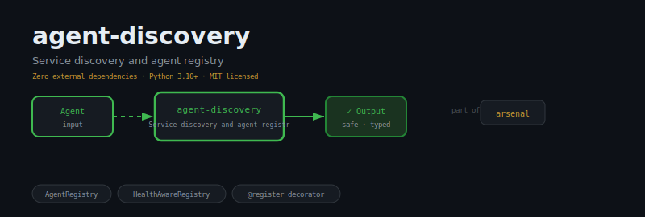
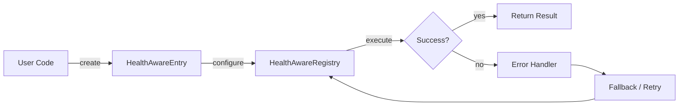
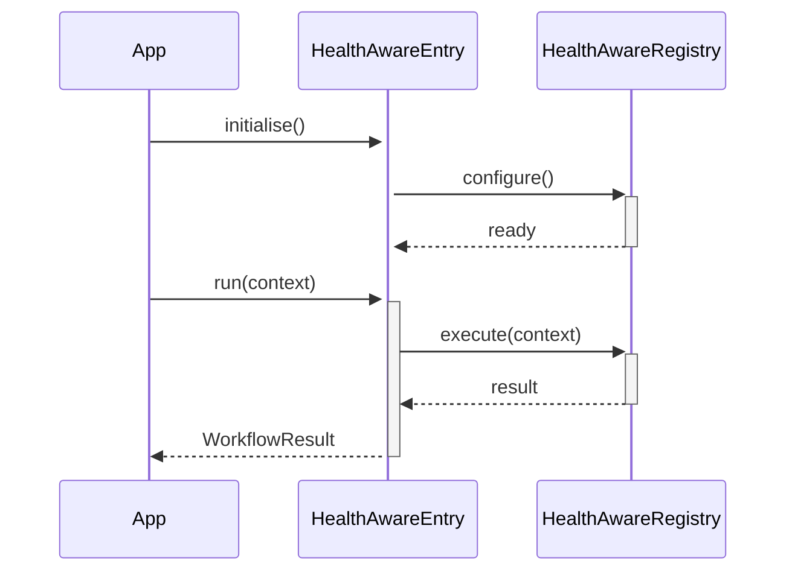

<div align="center">

</div>

# agent-discovery

**Service discovery and agent registry for multi-agent systems**

[](https://pypi.org/project/agent-discovery/) [](https://python.org) [](LICENSE) [](#)

---

## The Problem

Without service discovery, agent endpoints are hardcoded strings that break on every deployment. Dynamic discovery handles rolling updates, blue-green switches, and node failures without a human updating config files at 3 AM.

## Installation

```bash
pip install agent-discovery
```

## Quick Start

```python
from agent_discovery import HealthAwareEntry, HealthAwareRegistry, RegistryEntry

# Initialise
instance = HealthAwareEntry(name="my_agent")

# Use
# see API reference below
print(result)
```

## API Reference

### `HealthAwareEntry`

```python
class HealthAwareEntry(RegistryEntry):
    """RegistryEntry that also stores an optional health-check callable."""
    def __init__(self, *args: Any, health_check: Callable[[], bool] | None = None, **kwargs: Any) -> None:
    def is_healthy(self) -> bool:
        """Return True when no health_check is supplied, or when it returns True."""
    def to_dict(self) -> dict:
```

### `HealthAwareRegistry`

```python
class HealthAwareRegistry(AgentRegistry):
    """Agent registry with integrated health-check support."""
    def register(  # type: ignore[override]
    def available(self) -> list[str]:
        """Return names of all currently *healthy* entries."""
```

### `RegistryEntry`

```python
class RegistryEntry:
    """Immutable-ish record stored in the registry."""
    def __init__(
    def to_dict(self) -> dict:
    def __repr__(self) -> str:  # pragma: no cover
```

### `AgentRegistry`

```python
class AgentRegistry:
    """Central agent/service registry."""
    def __init__(self) -> None:
    def register(
    def unregister(self, name: str) -> None:
        """Remove a previously registered entry.  Raises KeyError if not found."""
```


## How It Works

### Flow



### Sequence



## Philosophy

> In the *Vedas*, *soma* was discovered through ritual search; service discovery is the ceremony that finds what is needed.

---

*Part of the [arsenal](https://github.com/darshjme/arsenal) — production stack for LLM agents.*

*Built by [Darshankumar Joshi](https://github.com/darshjme), Gujarat, India.*
